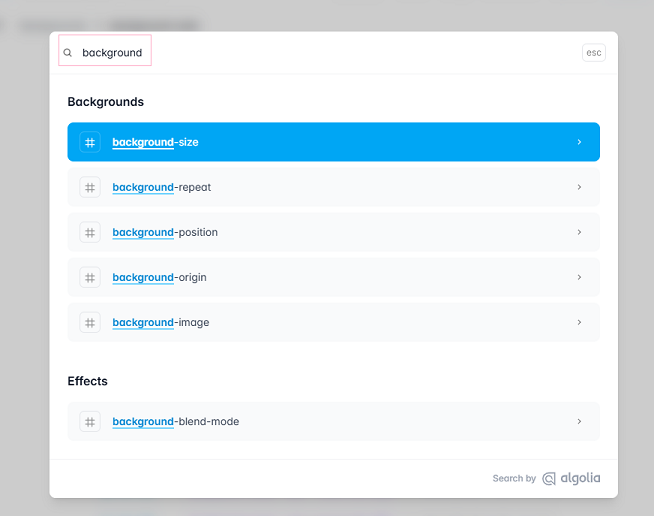

# [TAILWIND](https://tailwindcss.com/)

### TEMARIO

#### [INSTALAR](./01-install.md)

#### [COLORES](./02-colores.md)

#### [TEXTS](./03-text.md)

#### [BOX MODEL](./04-box-model.md)

#### [FLEX BOX](./05-flex-box.md)

#### [RESPONSIVE](./06-responsive.md)

#### [PSEUDOCLASES](./07-pseudoclases.md)

### TIPS

## BUSCAR PROPIEDAD TAILDWIND POR CSS

> - Ir a la [página de documentación](https://tailwindcss.com/docs/installation/using-vite).
> - Dar clic en buscar
>   
> - Escribir la propiedad CSS para buscar su equivalente en Taildwind.
>   
